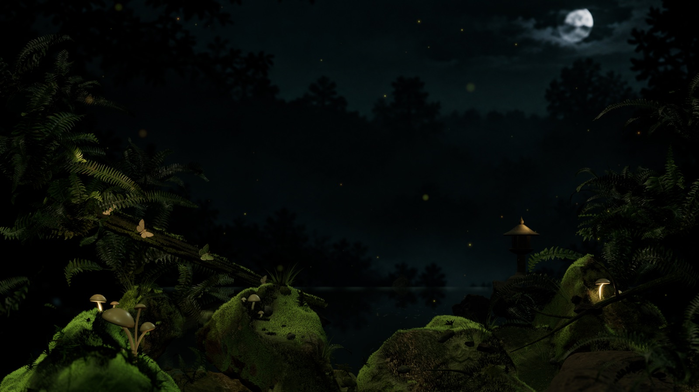

# Night Garden



A night forest for your desktop: mossy rocks around a dark pool, a stone lantern, two
moths on a fallen branch that fly off into the dark and come back, and fireflies that
notice your cursor. Everything is rendered live in Three.js and WebGL2, behind your icons
and windows, and it slows down or stops when you are not looking at it.

It is a remix of [Desktop Habitats](https://github.com/chaseleantj/desktop-habitats) by
[Chase Lean](https://x.com/chaseleantj), whose aquarium made me want a garden. His
wallpaper host, the part that puts a web view behind the desktop icons, reads the cursor
and watches the battery, is used almost unchanged. The scene is new.

Everything runs locally, with no account or internet connection needed after setup.
**macOS only** (13 or newer); you can also open the scene in a browser.

## Install on Mac

### From the download

1. Get `Night-Garden-<version>.zip` from the
   [latest release](https://github.com/esteugene/night-garden/releases/latest) and unzip it.
2. Open Terminal, drag `install.sh` from the unzipped folder into the window and press
   Return.
3. Wait about twenty seconds for the first frame.

The script copies the app to `~/Applications/Night Garden.app`, starts it and adds a login
item so the garden is back after a restart. During installation macOS may ask whether
Terminal can control System Events; that lets the installer set a still frame of the
scene as the desktop picture underneath the animation. You can decline.

### From the source

You need the Xcode command line tools (`xcode-select --install`). Clone or download this
repository, then in the project folder:

```sh
sh wallpaper/install.sh
```

This compiles the small Swift host for your Mac and installs it the same way. With
Node.js, `npm run wallpaper` does the same.

## Use the wallpaper

A moon appears in the menu bar:

- **Pause / Resume** stops and restarts the animation. Your choice is remembered.
- **Quit** closes the app until you open it again or sign in next.

Move the cursor near the fireflies and they drift towards it; move fast and they scatter.
Desktop icons, clicks and dragging work as usual.

The wallpaper renders only as much as is worth seeing:

| Desktop state | Rendering |
| --- | --- |
| Clearly visible, plugged in | Up to 60 fps |
| Clearly visible, on battery | Up to 30 fps, lower resolution |
| Mostly covered by windows | Up to 20 fps |
| Almost entirely covered | Stopped |
| Low Power Mode, locked screen or sleeping display | Stopped |

## Try it in a browser

With Node.js 20 or newer, in the project folder:

```sh
npm start
```

and open <http://127.0.0.1:8080>. There is no `npm install` step; the library is included.
Press **Space** to pause and **F** for fullscreen. `?stats=1` shows frame timing.

### Rearranging the scene

`?edit=1` opens a placement editor in the browser: click a rock, fern, mushroom or a
light marker and drag it, shift-drag for depth, alt-drag to turn. The panel edits light
colour, temperature and intensity, exposure and fog, thins or strips the moss on each
rock, and has an eraser (hotkey `E`) that rubs moss off wherever you drag. Edits are kept
in the browser; download them as `tuning.json`, put the file in `scenes/night-garden/`
and reinstall, and the wallpaper picks them up. Fibres you erased are then not generated
at all, which is also the simplest way to make the scene lighter on the GPU.

## FAQ

### Will it drain my battery?

It is a real 3D scene with about three million moss blades, soft shadows, depth blur and
bloom, so yes, it costs more than a still picture, and more than Riverscape. On an M5 Pro
driving a 5K display it kept the GPU around 70 percent busy at 60 fps; the frame-rate
limits above, the battery mode and Pause are the controls. If you want it lighter, erase
or thin the moss in the editor (see above) and reinstall.

### Does it watch my keystrokes?

No. It reads the cursor position so the fireflies can react, and window positions so it
knows how much of the desktop is visible. It does not read window contents, log the
cursor or send anything anywhere. There are no analytics, no network requests and no
Accessibility, Input Monitoring or Screen Recording permissions.

### Why has it stopped moving?

Open the moon menu: it says why. The wallpaper stops when almost entirely covered, in Low
Power Mode, and while the screen is locked or asleep. With Reduce Motion enabled it starts
paused; choose Resume if you want it anyway.

### Multiple displays?

Each display gets its own garden and renders separately.

### How do I update or remove it?

Update: install again from the new download or source. Remove:

```sh
sh wallpaper/uninstall.sh
```

(or `uninstall.sh` from the download). It stops the app, removes the login item and
deletes the app. The still picture stays at `~/Pictures/Night Garden.png` until you choose
another wallpaper in System Settings.

### macOS says the app cannot be opened

Releases are signed and notarised, so this should not happen with the download. If you
built it yourself the app is ad-hoc signed and runs on your own Mac only.

## Credits and licences

- [Desktop Habitats](https://github.com/chaseleantj/desktop-habitats) by Chase Lean, MIT:
  the wallpaper host, installer, frame loop and maths helpers.
- [iMoss](https://github.com/ledhieu/imoss) by Hieu Le, CC BY-NC 4.0: the moss bending
  shader. Because of it the wallpaper as a whole is **for non-commercial use**.
- [Poly Haven](https://polyhaven.com/), CC0: the rock, fern and moss models and the rock
  and wood textures.
- [Three.js](https://threejs.org/) r180, MIT.
- The background plate, moss colour texture and moth sprites were generated for this
  project; the prompts are in `scenes/night-garden/ASSET-PROMPTS.md`.

Details and full notices in [THIRD-PARTY.md](THIRD-PARTY.md). The code is MIT, see
[LICENSE](LICENSE). Development notes, including how the scene was built and measured,
are in [scenes/night-garden/DEVLOG.md](scenes/night-garden/DEVLOG.md).
